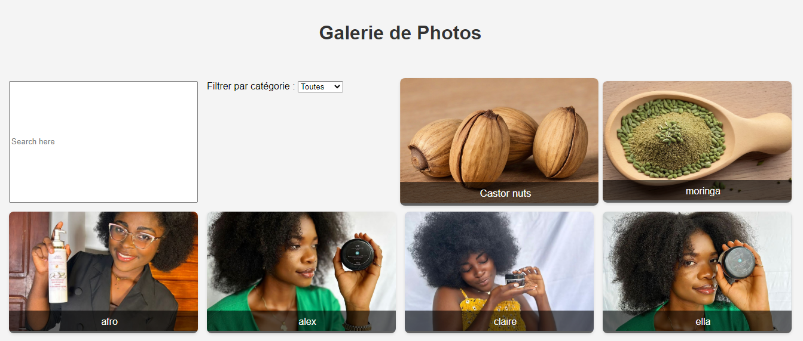
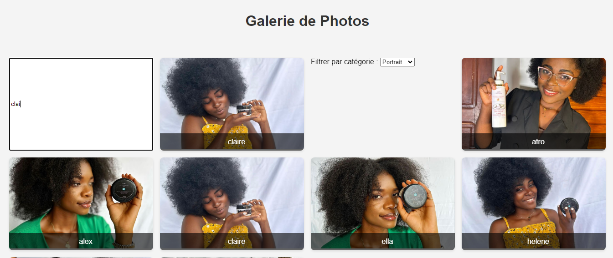
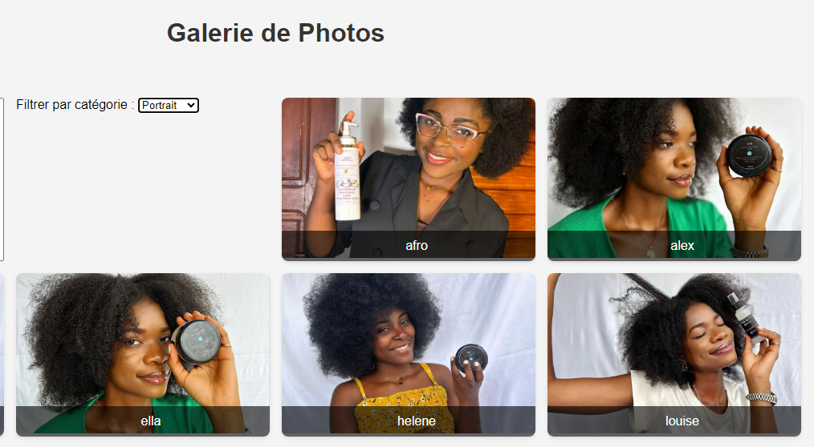

# GALERIE PHOTO

## DESCRIPTION
A react-based photo gallery that displays photos. users can filter photos by category and you have a searching bar to find out a photo from the title and a clean user interface.

 ## FEATURES 
- Display photos in a grid format.
- Filter photos by categories (e.g., nature, portraits, architecture, etc.).
- Search bar for quick access to specific photos.


## Getting Started

### Prerequisites

Before you begin, ensure you have the following tools installed on your system:

- [Node.js](https://nodejs.org/) (version 12.x or higher)
- [npm](https://www.npmjs.com/) or [yarn](https://yarnpkg.com/)


 ## INSTALLATION
1. **Clone the repository**
 ```bash
 git clone
https://github.com/laroche237/photo-gallery-react-app.git
 cd photo-gallery-react-app
 npm install
 npm start
 ```

 The app will run at `http://localhost:3000`.

 ### Building for Production

To create an optimized production build:

bash
npm run build

or
bash
yarn build

## USAGE

This will create a `build/` directory with the optimized static files.

 1. **Adding photos:**
   - Photos are stored as object  in the `src/data/photos.js` file.
   - Add your photos by updating the JS file with the following format:
   json
   {
    id: 10,
      title:'karité',
      src: karite,
      alt:'femmes de karité',
      credit:'laroche237',
      category:'Paysage',
   }
   

2. **Customizing categories:**
   - You can modify the categories in the `src/data/photos.js` file to modify the category of the photos. the categories will be extract and add automatically.

3. **Search functionality:**
   - Users can search for photos based on their title using the search bar at the top of the gallery.

   

## SCREENSHOTS




## Tech Stack

- **React** - A JavaScript library for building user interfaces.
- **CSS3** - For styling and layout.
- **React Hooks** - For state management and lifecycle methods.
- **JavaScript ES6+** - Modern JavaScript features.


## Contributing

Contributions are welcome! If you would like to contribute to this project, feel free to open an issue or submit a pull request. Please ensure your changes are well-documented and tested.

## License

This project is licensed under the MIT License 

## Contact

For any questions or feedback, feel free to reach out:

- Email: [nyabengrlle@gmail.com](mailto:nyabengrlle@gmail.com)
- GitHub: [Laroche237](https://github.com/laroche237)


